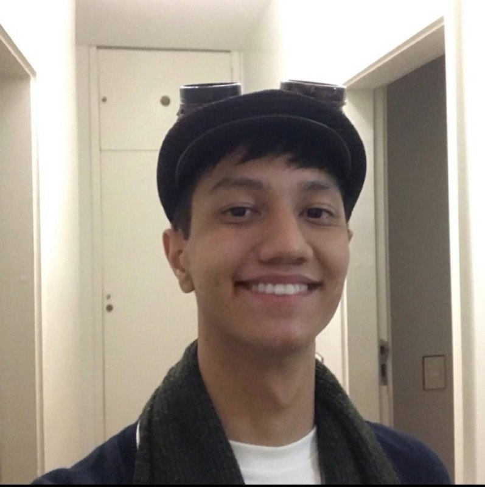

# Munchkin

## Sobre

    

#

## 🎯 Objetivo

Este projeto tem como objetivo principal ser objeto de avaliação pelo professor na disciplina de Sistemas de Bancos de Dados I ministrada na Universidade de Brasília, Campus Gama - FGA.

## 🦸‍♀️ Inspiracoes

- [Munchkin](https://munchkin.game/)
- [Darkest Dungeon](https://www.wikiwand.com/en/Darkest_Dungeon)
- [Slay The Spire](https://www.wikiwand.com/en/Slay_the_Spire)
- [Guild of Dungeoneering](https://www.wikiwand.com/en/Guild_of_Dungeoneering)
- [Dungeons & Dragons](https://dnd.wizards.com/pt-BR)

## 🧝 Como jogar?

## 🦹‍♀️ Tecnologias

    
    

## 🧙 Devs

## Equipe

| Foto | Nome | Github |
|:--:|:--:|:--:|
||<a href="https://github.com/Matheuspleal"style="text-decoration:none">Matheus Pimentel Leal</a>| Matheuspleal |
||<a href="https://github.com/LuizPettengill" style="text-decoration:none">Luiz Pettengill</a>| LuizPettengill |
||<a href="https://github.com/Francisco1code" style="text-decoration:none">Francisco Emanoel Ferreira</a>| Francisco1code |
||<a href="https://github.com/Yukioz" style="text-decoration:none">Victor Yukio</a>| Yukioz
||<a href="https://github.com/alvesitalo" style="text-decoration:none">Ítalo Alves</a>| alvesitalo
